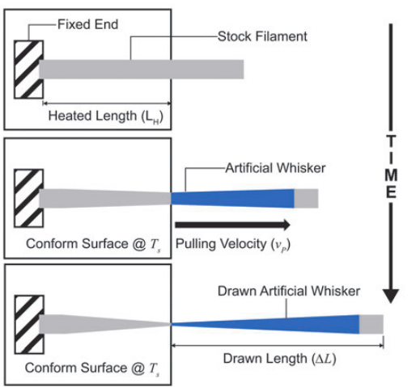
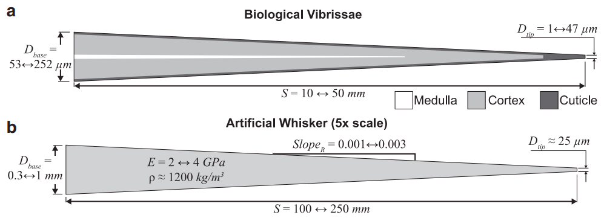
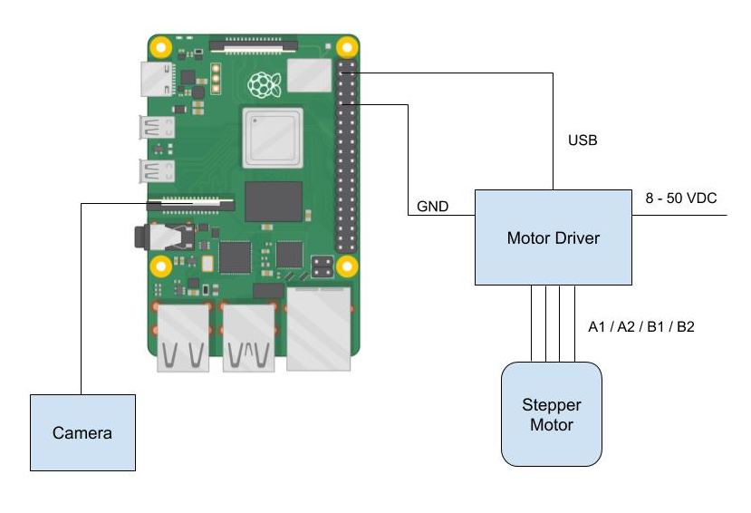
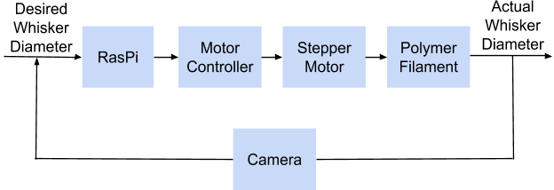
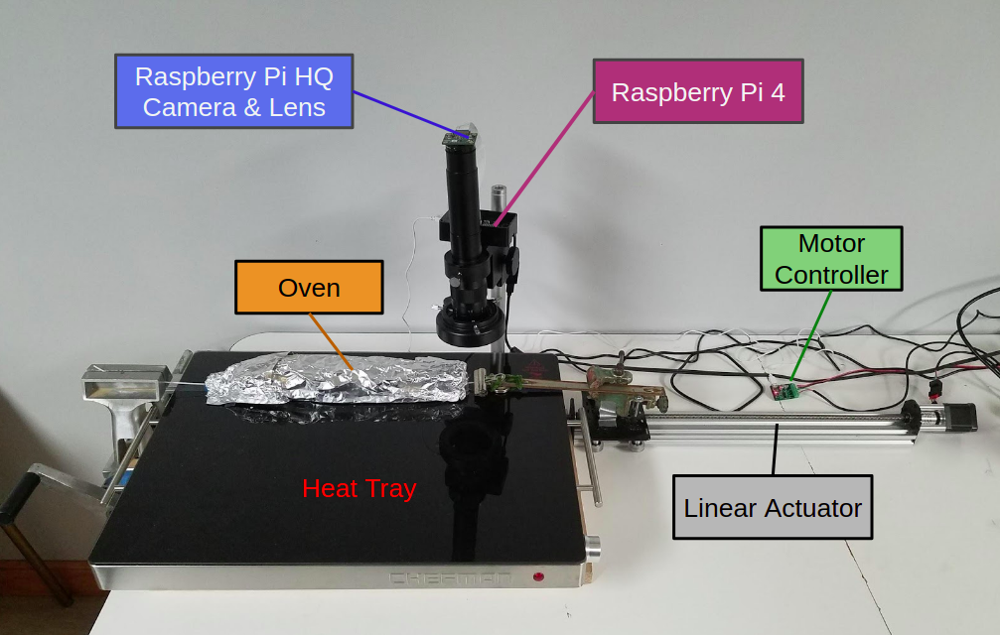
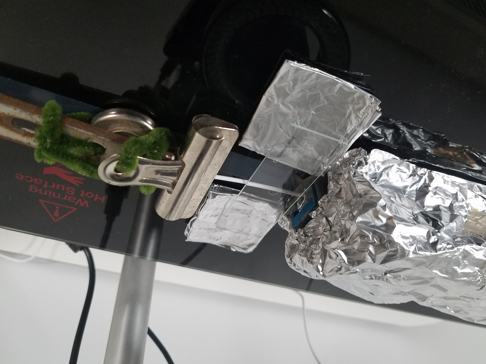
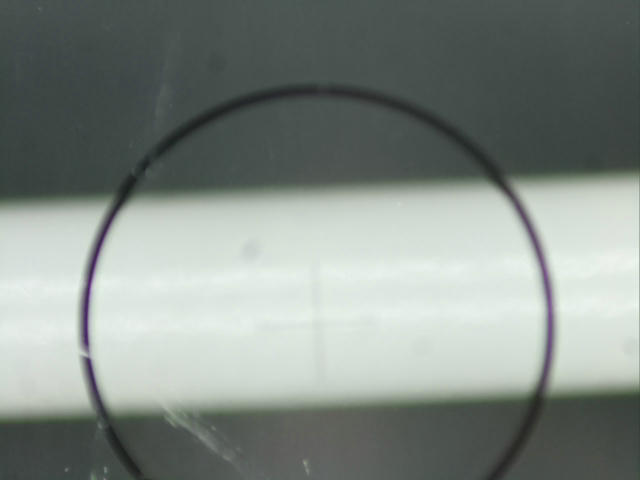
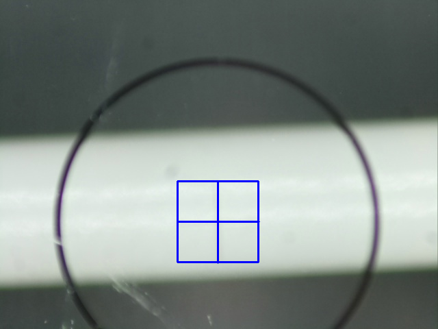
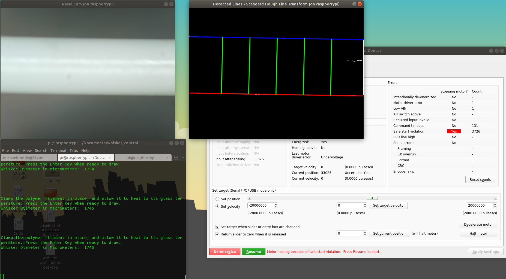

# Whisker Drawing Mechanism

## Table of Contents
- [Project Objectives](#project-objectives)
- [Design Specifications](#design-specifications)
- [Materials](#materials)
- [System Design](#system-design)
- [Computer Vision](#computer-vision)
- [Repository Structure](#repository-structure)
- [Installation](#installation)
- [Usage](#usage)
    - [Tic GUI and Motor Settings](#tic-gui-and-motor-settings)
    - [Camera Calibration](#camera-calibration)
    - [Whisker Drawing](#whisker-drawing)
        - [Important Equations and Variables](#important-equations-and-variables)
- [Quick Guide](#quick-guide)
- [Next Steps](#next-steps)
- [Links](#links)

## Project Objectives

The purpose of this project is to design a device that manufactures robotic whisker sensors by drawing polymer plastic filament from an oven. It must be able to inspect the diameter of the whisker and adjust the draw speed accordingly to match a specific geometric profile. This process must be quick and repeatable. 

The image below shows how the shape of the filament develops over time. The heated length of the filament is brought to the plastic's glass transition temperature. Then the filament is pulled away from the oven by the drawing mechanism to create a taper.

Check out this project in my portfolio at https://michaeldoody.github.io/.
 
 



The artificial whisker geometric profile imitates that of a biological whisker at a 5x scale (see image below). These dimensions drove the design specifications for the drawing mechanism. 




## Design Specifications

Given the dimensions of an artificial whisker, the mechanism must:
- Include a linear actuator that can draw a 250 mm whisker in approx. 2 mins
- Achieve a velocity range of 0.01 mm/s - 10 mm/s
- Include velocity feedback control to regulate the whisker taper
- Have computer vision to inspect the whisker diameter in micrometers

## Materials
- V-Slot® NEMA 17 Linear Actuator Bundle (Lead Screw), 400m stroke
- NEMA 17 Stepper Motor
- Tic 36v4 USB Multi-Interface High-Power Stepper Motor Controller [(User's Guide)](https://www.pololu.com/docs/0J71)
- Raspberry Pi 4
- Raspberry Pi High Quality Camera
- Monocular Max 300x Zoom C-Mount Glass Lens
- Microscope Camera Table Stand
- Adjustable LED Ring Light
- Electric Warming Tray with Adjustable Temperature Control
- 24V 4A 100W Power Supply Adapter
- Cable Assembly 2.1mm ID, 5.5mm OD Jack to Wire Leads
- Infrared Thermometer
- Microscope Camera Calibration Slide Ruler
- PolyMax<sup>TM</sup> PC 3D Printing Filament (1.75 mm diameter)
- Low-Friction Tape Made with Teflon


## System Design
A block diagram of the system is depicted below. The Raspberry Pi controls the velocity of the lead screw linear actuator via the Tic motor controller. A High Quality Raspberry Pi camera is connected to the RasPi. 



This setup allows the device to perform the following closed control loop. In order to acheive the proper whisker taper, the RasPi is provided a desired whisker diameter and sends the Tic a command to speed up or slow down the motor velocity based on the camera's examination of the whisker.



The finished setup looks like this:



## Computer Vision

In order to accurately measure the whisker diameter, the camera and lens must be first focused on a calibration slide's 1mm x 1mm reticle stacked on top of a sample of the plastic filament.

Next, I used the script `cam_calibration.cpp` to measure the length of the reticle in pixels and calculate pixels/μm.

## Repository Structure

    .
    ├── cam_calibration.cpp      # Outputs the pixels/μm constant when the calibration slide
    ├                              reticle is in view of the camera
    ├── whisker.cpp              # Velocity control loop
    ├── data/                    # Data from each whisker drawing trial is stored here in .csv files
    ├── media/                   # Image files folder
    └── README.md

## Installation

You can clone this GitHub repository: `git clone https://github.com/michaeldoody/whisker_control`

The following packages (Tic software, OpenCV, and gcc) are already installed on the Raspberry Pi 4 that I used for this project, so if you are using the same one I used, you can skip to [Usage](#usage).

Detailed instuctions for downloading the Tic motor controller software for Raspberry Pi and source code can be found [here](https://www.pololu.com/docs/0J71/3.2).

And instuctions for installing OpenCV on Raspberry Pi are [here](https://www.learnopencv.com/install-opencv-4-on-raspberry-pi/).

Install GNU C++ Development Tools on the RasPi 4 using `sudo apt-get install gcc` if it is not already installed.

## Usage
WARNING: Keep hands and cords away from the linear actuator while it is powered on. Use heat resistant gloves when inserting and removing the plastic filament from the heated oven.

To use the RasPi, you can either connect a monitor to it via its HDMI port along with a mouse and keyboard, or you can connect remotely by using SSH. To SSH using Linux or Mac OS, make sure the RasPi is powered on, and type in your Linux / Mac:

```shell
ssh -X pi@<IP>
```

where you replace `<IP>` with your RasPi's IP address. The `-X` is so that you can open up and use GUIs remotely. You will be prompted to type in your RasPi password. After powering on the RasPi, it may take a minute until it allows you to connect, so if you get an error saying `ssh: connect to host <IP> port 22: No route to host`, keep trying the ssh command until you are prompted for your password. If you need help determining your RasPi's IP address, use a different OS for remote access, or need help troubleshooting, please see the [Raspberry Pi documentation on SSH](https://www.raspberrypi.org/documentation/remote-access/ssh/). 

To shutdown and exit the RasPi remotely:

```shell
sudo shutdown -h -P now
```

### Tic GUI and Motor Settings
Connect the Tic Motor Controller to the RasPi 4 via USB. Power on the RasPi. Whether working on the RasPi with a monitor or remotely, open up the Pololu Tic Control Center (Tic GUI):

```shell
ticgui
```

Navigate over to the Input an motor settings tab. In the "Motor" box, make sure that the settings are set to:
- Max Speed: 180000000
- Starting Speed: 2500
- Max Acceleration: 1800000
- Step Mode: 1/4 step
- Current Limit: 2005 mA

Detailed documentation on these settings can be found [here](https://www.pololu.com/docs/0J71/4.3).

Leave the Tic GUI open for when you are calibrating the camera and drawing whiskers.

### Camera Calibration
The purpose of `cam_calibration` is to measure how many pixel lengths equal a micron while a whisker filament and a calibration slide are in focus of the camera. The resulting number is saved in `ppum.txt` as a decimal. This process only needs to be done once, given that the camera lens' focus is not adjusted any time after calibrating.

#### Calibration Instructions
1. Plug in the power adapter connected to the Tic. Open the Tic GUI. In the "Set Target" box, select the "Set velocity" radio button and the "Return slider to zero when it is released" checkmark button. Click the green Resume button at the bottom of the GUI to energize the motor. Use the slider to move the actuator to its greatest position before reaching the end of the track. You can view the current motor position in the "Operation" box.
2. Cut a length of 3D printing filament ~500 mm long. PolyMax<sup>TM</sup> PC was used for this project (1.75 mm diameter, 113&deg;C glass transition temperature). Feed the filament through the front of the oven so that one end of the filament is exposed at either end of the oven. Clip one end of the filament to the metal binder clip. Allow ~4 cm between between the oven exit and the binder clip. Secure the other end with a vice that is attached to the table.
3. Cut a generous portion of aluminum foil in two. Fold both in half six times, and lay one on each side of the exposed filament. Rest the calibration slide on the filament and two aluminum foil pieces so that the "1 DIV = 0.01mm" reticle is centered on the filament, shown below. Turn on the LED ring lamp.



4. From your RasPi command line:
```shell
# Change to the whisker directory
cd Documents/whisker_control

# Compile cam_calibration program (only need to do this once after editing cam_calibration.cpp)
g++ "cam_calibration.cpp" `pkg-config libpololu-tic-1 --cflags --libs opencv` -o "cam_calibration"

# Run cam_calibration
./cam_calibration
```
5. A window showing the camera video stream will appear. Center the filament and reticle, and straighten the crosshairs so that the x-axis is as horizontal as possible. Using the maginfication dial on the microscope, focus the camera lens so that the edges of the filament are as focused as possible while the reticle is still visible, yet blurry, as shown below. Press Space or S to capture the current video frame.



6. A second window will appear that shows the image you just captured. Use your mouse to drag and drop a ROI box around the blurry reticle. Draw the box as tight as possible, like in the image below, to get an accurate measuremnt of the height and width of the crosshairs. To retry the process, press Esc and rerun the program. Once you have drawn an acurate ROI box, press the Spacebar to view the cropped image in a third window. Press the Spacebar again to save the Pixels Per Micrometer measurement to ppum.txt, or press Esc to cancel.



The camera is now calibrated, and you are ready to draw whiskers!

### Whisker Drawing
The `whisker` program consists of two phases: the setup / heating phase and the drawing phase.

#### Whisker Drawing Instructions
1. Power on the RasPi, the Tic / motor, and the LED lamp. Turn on the heat tray so that its dial notch is pointing directly downwards (almost at the High heat setting). Allow the tray to heat up for about 20 minutes.
2. While the tray is heating up, open up `ticgui`. Use the slider in the "Set target" box to manually move the actuator to the end of the track that is closest to the oven, and leave a ~0.5 cm gap between the edge of the gantry plate and the lock collar. Find the current position of the motor in the "Operation" box of the GUI. Open up whisker.cpp and edit the START_POS to equal the value of the current motor position (whisker.cpp, Line TODO).
3. From your RasPi command line:
```shell
# Change to the whisker directory
cd Documents/whisker_control

# Compile whisker program (only need to do this once after editing whisker.cpp)
g++ "whisker.cpp" `pkg-config libpololu-tic-1 --cflags --libs opencv` -o "whisker"

# Run whisker
./whisker
```
4. The actuator will automatically move to its starting position closest to the oven. Cut a length of 3D printing filament ~500 mm long. Feed the filament through the front of the oven so that one end of the filament is exposed at either end of the oven. Clip one end of the filament to the metal binder clip. Allow ~4 cm between between the oven exit and the binder clip. Secure the other end with a vice that is attached to the table.

5. Allow the filament to heat up in the oven for 2 minutes. Two windows will open on your screen: one that shows the camera's view and another that shows the detected filament edges (blue and red lines) along with five measurements of the filament diameter (green lines). The average of these five diameter are shown in the command line window. As a confirmation of the accuracy of the camera calibration test, the average diameter should be 1750 +/- 40 microns (when using PolyMax<sup>TM</sup> PC 1.75 mm diameter 3D Printing Filament).



5. Once the filament has heated up for 2 minutes, press the Spacebar to begin drawing the whisker. The motor will follow the velocity profile in Line TODO while the RasPi measures the diameter of the whisker in each frame of the video stream. The expected current whisker diameter is calculated based on the whisker parameters set in Lines TODO-TODO and the linear actuator's current position. The RasPi compares the measured diameter to the expected diameter and then commands the motor to adjust its velocity proportionally to the error. If the whisker diameter is too large, the motor will speed up, or if it's too small, the motor will slow down.

6. The motor will stop once a coded limit switch is triggered. Remove the drawn whisker from vice, and allow it to cool for a few seconds. Remove the left over filament from the oven and discard. If, however, the filament did not split in two during the drawing process, cut the filament in two at the oven exit. Remove and discard both pieces of filament. See [Important Equations and Variables](#important-equations-and-variables) for adjustments you can make to the code in order for the filament to taper and separate into two parts as expected.

#### Important Equations and Variables
The equations and variables listed below can be adjusted to produce better results for your whiskers

- START_POS (Line TODO)
    - The position that the motor resets to at the beginning of each whisker drawing trial. Adjust this value in the event that the motor stalls or skips steps. You can find a suitable value by opening up the Tic GUI and using the slider in the "Set target" box to manually move the actuator to the end of the track that is closest to the oven. Leave a ~0.5 cm gap between the edge of the gantry plate and the lock collar. Find the current position of the motor in the "Operation" box of the GUI, and set START_POS to that number.

- baseDia, tipDia, arcLen (Lines TODO)
    - The base diameter, tip diameter, and arc length of the whisker. These parameters can be adjusted to fit your desired whisker geometric profile.

- PID control (Lines TODO)
    - Adjust Kp, Ki, and Kd to adjust feedback control based on the camera measurements of the whisker diameter. At the time of writing, only proportional control is implemented.

- motorVel (Line TODO)
    - The velocity equation that the motor follows before taking into account feedback control. It follows the form *at^3 + b*, where *t* is 

### Quick Guide


### Next Steps


## Links
Check out this project in my portfolio at https://michaeldoody.github.io/
