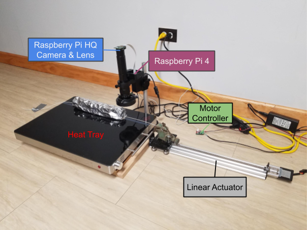
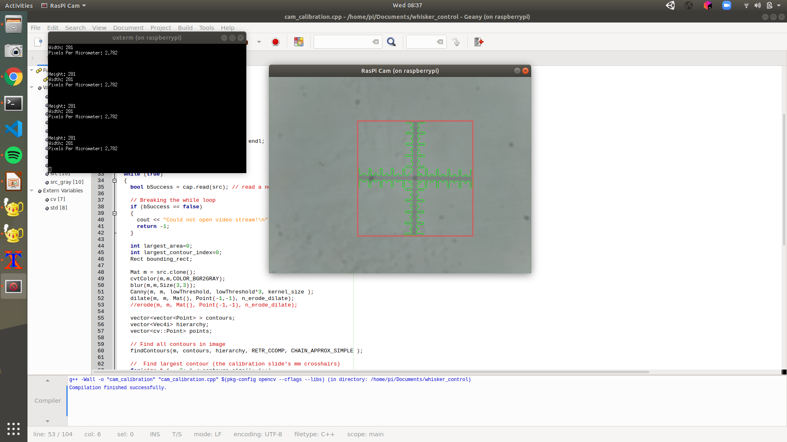

# Whisker Drawing Mechanism

## Table of Contents
- [Project Objectives](#project-objectives)
- [Design Specifications](#design-specifications)
- [Materials](#materials)
- [System Design](#system-design)
- [Computer Vision](#computer-vision)
- [Repository Structure](#repository-structure)
- [Installation](#installation)
- [Usage](#usage)
    - [Motor Settings](#motor-settings)
    - [Camera Calibration](#camera-calibration)
    - [Whisker Drawing](#whisker-drawing)
- [Links](#links)

## Project Objectives

The purpose of this project is to design a device that manufactures robotic whisker sensors by drawing polymer plastic filament from an oven. It must be able to inspect the diameter of the whisker and adjust the draw speed accordingly to match a specific geometric profile. This process must be quick and repeatable. 

The image below shows how the shape of the filament develops over time. The heated length of the filament is brought to the plastic's glass transition temperature. Then the filament is pulled away from the oven by the drawing mechanism to create a taper.

Check out this project in my portfolio at https://michaeldoody.github.io/.
 
 


The artificial whisker geometric profile imitates that of a biological whisker at a 5x scale (see image below). These dimensions drove the design specifications for the drawing mechanism. 


## Design Specifications

Given the dimensions of an artificial whisker, the mechanism must:
- Include a linear actuator that can draw a 250 mm whisker in approx. 2 mins
- Achieve a velocity range of 0.01 mm/s - 10 mm/s
- Include velocity feedback control to regulate the whisker taper
- Have computer vision to inspect the whisker diameter in micrometers

## Materials
- V-Slot® NEMA 17 Linear Actuator Bundle (Lead Screw), 400m stroke
- NEMA 17 Stepper Motor
- Tic 36v4 USB Multi-Interface High-Power Stepper Motor Controller
- Raspberry Pi 4
- Raspberry Pi High Quality Camera
- Monocular Max 300x Zoom C-Mount Glass Lens
- Microscope Camera Table Stand
- Adjustable LED Ring Light
- Electric Warming Tray with Adjustable Temperature Control
- 24V 4A 100W Power Supply Adapter
- Cable Assembly 2.1mm ID, 5.5mm OD Jack to Wire Leads
- FLIR ONE Gen 3 Thermal Camera Smart Phone Attachment
- Microscope Camera Calibration Slide Ruler
- Low-Friction Tape Made with Teflon


## System Design
A block diagram of the system is depicted below. The Raspberry Pi controls the velocity of the lead screw linear actuator via the Tic motor controller. A High Quality Raspberry Pi camera is connected to the RasPi. 


This setup allows the device to perform the following closed control loop. In order to acheive the proper whisker taper, the RasPi is provided a desired whisker diameter and sends the Tic a command to speed up or slow down the motor velocity based on the camera's examination of the whisker.


The finished setup looks like this:



## Computer Vision

In order to accurately measure the whisker diameter, the camera and lens must be first focused on a calibration slide's  1mm x 1mm reticle stacked on top of a sample of the plastic filament.


Next, I used the script `cam_calibration.cpp` to measure the reticle in pixels and calculate pixels/μm (displayed below). This project is still a work in progress, so the next step is to finish the script `whisker.cpp` which takes the pixels/μm constant, measures the diameter of the whisker section that is directly outside the oven, and performs the velocity control loop.



## Repository Structure

    .
    ├── cam_calibration.cpp      # Outputs the pixels/μm constant when the calibration slide
    ├                             reticle is in view of the camera
    ├── whisker.cpp              # Velocity control loop
    ├── data/                     # Data from each whisker drawing trial is stored here in .csv files
    ├── media/                    # Image files folder
    └── README.md

## Installation

You can clone this GitHub repository: `git clone https://github.com/michaeldoody/whisker_control`

The following packages (Tic software, OpenCV, and gcc) are already installed on the Raspberry Pi 4 that I used for this project, so if you are using the same one I used, you can skip to [Usage](#usage).

Detailed instuctions for downloading the Tic motor controller software for Raspberry Pi and source code can be found [here](https://www.pololu.com/docs/0J71/3.2).

And instuctions for installing OpenCV on Raspberry Pi are [here](https://www.learnopencv.com/install-opencv-4-on-raspberry-pi/).

Install GNU C++ Development Tools on the RasPi 4 using `sudo apt-get install gcc` if it is not already installed.

## Usage
WARNING: Keep hands and cords away from the linear actuator while it is powered on. Use heat resistant gloves when inserting and removing the plastic filament from the heated oven.

To use the RasPi, you can either connect a monitor to it via its HDMI port along with a mouse and keyboard, or you can connect remotely by using SSH. To SSH using Linux or Mac OS, make sure the RasPi is powered on, and type in your Linux / Mac:

`ssh -X pi@<IP>`

where you replace `<IP>` with your RasPi's IP address. The `-X` is so that you can open up and use GUIs remotely. You will be prompted to type in your RasPi password. After powering on the RasPi, it may take a minute until it allows you to connect, so if you eget an error saying `ssh: connect to host <IP> port 22: No route to host`, keep trying the ssh command until you are prompted for your password. If you need help determining your RasPi's IP address, use a different OS for remote access, or need help troubleshooting, please see the [Raspberry Pi documentation on SSH](https://www.raspberrypi.org/documentation/remote-access/ssh/). 

To shutdown and exit the RasPi remotely:
`sudo shutdown -h -P now`

### Motor Settings

### Camera Calibration
The purpose of `cam_calibration` is to measure how many pixel lengths equal a micron while a whisker filament and a calibration slide are in focus of the camera. The resulting number is saved in `ppum.txt` as a decimal. This process only needs to be done once, given that the camera lens' focus is not adjusted any time after calibrating.

```shell
#Change to the whisker directory
cd Documents/whisker_control

```
Compile `cam_calibration.cpp` by typing in the command line:
`g++ "cam_calibration.cpp" `pkg-config libpololu-tic-1 --cflags --libs opencv` -o "cam_calibration"`

### Whisker Drawing
Compile `whisker.cpp` by typing in the command line:
`g++ "whisker.cpp" `pkg-config libpololu-tic-1 --cflags --libs opencv` -o "whisker"  (in directory: /home/pi/Documents/whisker_control)`


## Links
Check out this project in my portfolio at https://michaeldoody.github.io/
