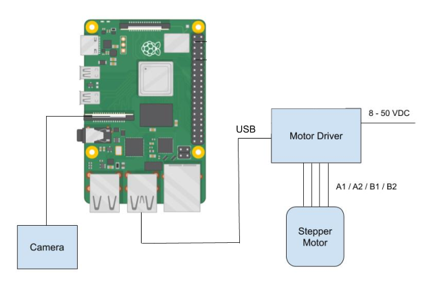

# Whisker Drawing Mechanism
Check out this proect in my portfolio at https://michaeldoody.github.io/
## Project Obectives

The purpose of this project is to design a device that manufactures robotic whisker sensors by drawing polymer plastic filament from an oven. It must be able to inspect the diameter of the whisker and adjust the draw speed accordingly to match a specific geometric profile. This process must be quick and repeatable. 

The image below shows how the shape of the filament develops over time. The heated length of the filament is brought to the plastic's glass transition temperature. Then the filament is pulled away from the oven by the drawing mechanism to create a taper.
 
 

The artificial whisker geometric profile imitates that of a biological whisker at a 5x scale (see image below). These dimensions drove the design specifications for the drawing mechanism. 

## Design Specs

Given the dimensions of an artificial whisker, the mechanism must:
- Include a linear actuator that can draw a 250 mm whisker in approx. 2 mins
- Acheive a velocity range of 0.01 mm/s - 10 mm/s
- Include velocity feedback control to regulate the whisker taper
- Have computer vision to inspect the whisker diameter in micrometers

## Materials
- V-Slot® NEMA 17 Linear Actuator Bundle (Lead Screw), 400m stroke
- NEMA 17 Stepper Motor
- Tic 36v4 USB Multi-Interface High-Power Stepper Motor Controller
- Raspberry Pi 4
- Raspberry Pi High Quality Camera
- Monocular Max 300x Zoom C-Mount Glass Lens
- Microscope Camera Table Stand
- Adjustable LED Ring Light
- Electric Warming Tray with Adjustable Temperature Control
- 24V 4A 100W Power Supply Adapter
- Cable Assembly 2.1mm ID, 5.5mm OD Jack to Wire Leads
- FLIR ONE Gen 3 Thermal Camera Smart Phone Attachment
- Microscope Camera Calibration Slide Ruler
- Low-Friction Tape Made with Teflon

## System Design
A block diagram of the system is depicted below. The Raspberry Pi controls the velocity of the lead screw linear actuator via the Tic motor controller. A High Quality Raspberry Pi camera is connected to the RasPi. 

This setup allows the device to perform the following closed control loop. In order to acheive the proper whisker taper, the RasPi is provided a desired whisker diameter and sends the Tic a command to speed up or slow down the motor velocity based on the camera's examination of the whisker.

